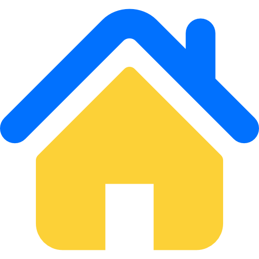
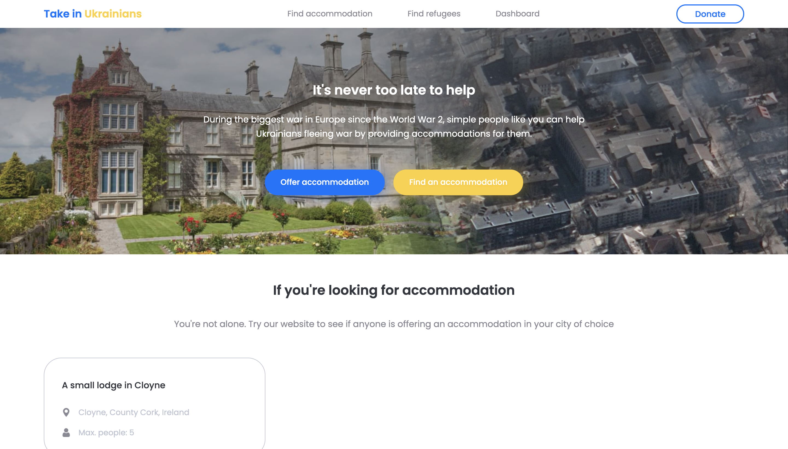
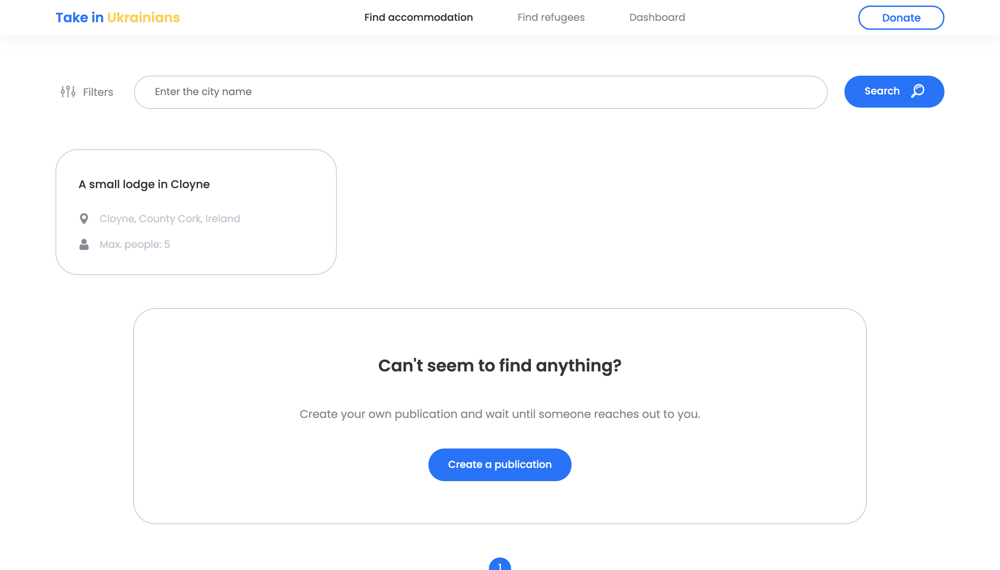
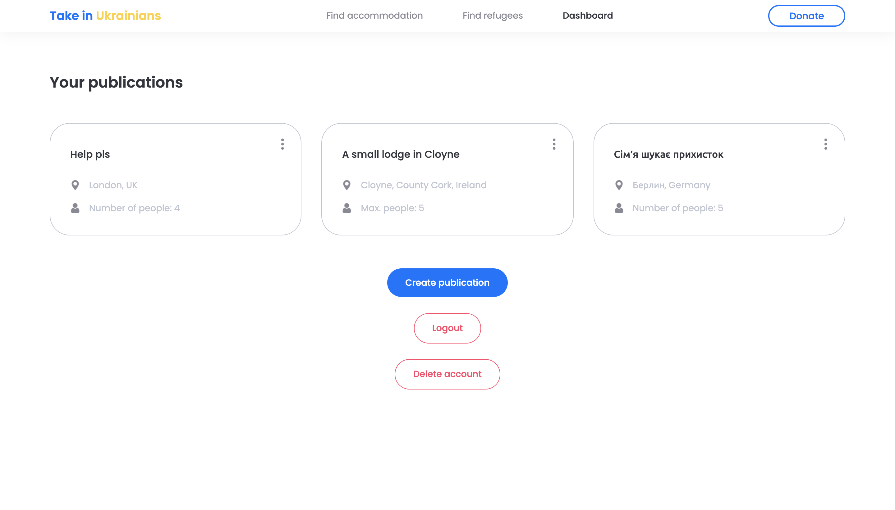
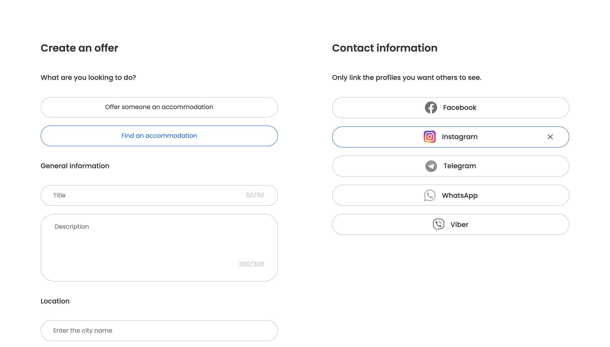

  
  <h1>Take in Ukrainians</h1>
  
Online service for people providing accommodation to Ukrainians fleeing war.

## Goal

The project serves the goal of connecting Ukrainians in need of accommodation and those willing to provide it. The project has been developed and maintained by one person. While it was in development, most of the EU countries have implemented policies that essentially ban locals from taking in refugees without notifying the government to avoid potentially dangerous/abusive scenarios taking place. That said, this project was designed to be a last-resort option for people who ran out of options.

### TLDR; Please contact the local government first and make sure they cannot arrange accommodation for you before resorting to this service!

## Screenshots

|       |        |
| --------------------------------------- | ---------------------------------------- |
|  |  |

## Stack

- Typescript
- Next.js
- Styled-components
- PostgreSQL

## FAQ

> How is this different from dozens of other projects that do the same thing?

This app is my attempt at making things the way I think is right. Other websites that serve the same purpose tend to have rather unintuitive UIs and lack some of the features that I implemented here. T In this version people who are in need of accommodation can make publications themselves instead of having to constantly stalk the website to see new offers in their location.

> How secure is it?

I tried my best to make it as secure as I possibly could, but I'm pretty sure it could be hijacked by anyone who has a semi-decent knowledge of hacking.
